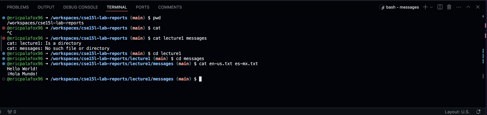

# **Lab Report #1**
***

## ```cd``` - change directory
***

no arguments - Absolute path: (```/workspaces/cse15l-lab-reports```)
- While running ```cd``` with no arguments, we are changing directory into the home or root folder since no argument was given. In this case we can run pwd and we see that it is ```/home/codespace``` when using the Github codespaces. There is no error as this is the expected output for the given input.

directory - Absolute path: (```/home/codespace```)
- While running ```cd nvm``` with a directory ```nvm``` as the argument, this will result in an output of the previous working directory along with the ```/nvm``` appended since we have moved into the ```nvm``` directory with the ```cd``` command. There is no error as this is the expected output for the given input.

file - Absolute path: (```/home/codespace/nvm```)
- While running ```cd README.md``` we are trying to change directories into a file, however, this is not possible since we are changing the working directory and this cannot be a file. In this case we can see the output as ```cd: README.md: Not a directory``` since we can only use cd to change into different directories, not files. This is a user input error, however, there is no programming error as this is expected since this is not a valid input for the given command, we must be sure to include a directory to avoid this error.


## ```ls``` - list
***

no arguments - Absolute path: (```/home/codespace```)
- While running ```ls``` with no arguments, the output will list all of the contents in our current working folder, in this case the contents listed in ```/home/codespace```. The contents in this directory are ```nvm``` and ```java```. Also note that no argument was inputted so bash will automatically assume you would like the listed contents of the current working directory. There is no error as this is the expected output for the given input.

directory - Absolute path: (```/home/codespace```)
- While running ```ls java``` we are listing all of the contents found in the ```/home/codespace/java``` and we can see that there are ```17.01.10-ms```, ```21.0.2-ms```, and ```current``` within the java folder/directory. The output will list all of the contents of the given path, this case we say that these files and current directory are within the current working directory with ```/java``` appended. There is no error as this is the expected output for the given input.

file - Absolute path: (```/home/codespace/nvm```)
- While running ```ls README.md``` the output will be the same argument which is ```README.md``` since this is a file and there is nothing to list but the name of the file itself. If there were more contents within this location, then we would be able to see the list but this is the file so this will list the name of the file only. There is no error as this is the expected output for the given input.


## ```cat``` - concatenate
***

no arguments - Absolute path (```/workspaces/cse15l-lab-reports```)
- While running ```cat``` the terminal will actually stop running as there is no way to concatenate something that is empty. We must be sure that we are giving at least 1 argument to ensure that ```cat``` will run properly, hence there is no output and we must terminate using (CTRL)+(C). This is a user input error and there is no error message as we are forced to terminate.

directory - Absolute path (```/workspaces/cse15l-lab-reports```)
- While running ```cat lecture1 messages``` we receive an error message which indicates that we cannot concatenate a directory, we are only able to concatenate files with other files, but not directories. This would certainly be an issue if it were possible as we may accidentally concatenate the wrong contents which may lead to potential issues. Also, we can see that ```/messages``` is not located within this directory, we must be sure that we are within the lecture1 directory to be able to access ```/messages```.

file - Absolute path (```/workspaces/cse15l-lab-reports/lecture1/messages```)
- While running ```cat es-us.txt es-mx.txt``` we can see an output of ```Hello World! ¿Hola Mundo?``` since these are the contents within each of the files, respectively. Hence, the two contents will be appended and we will see the output of the concatenated files together. There is no error as this is the expected output for the given input.


