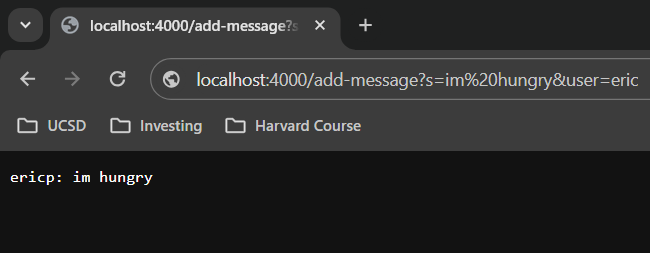
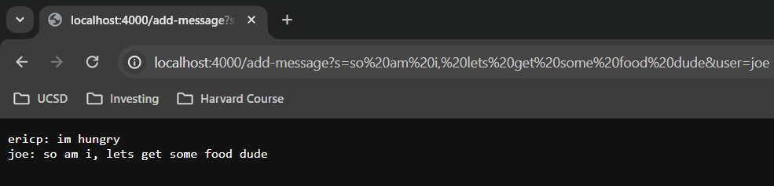
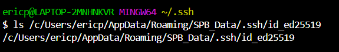
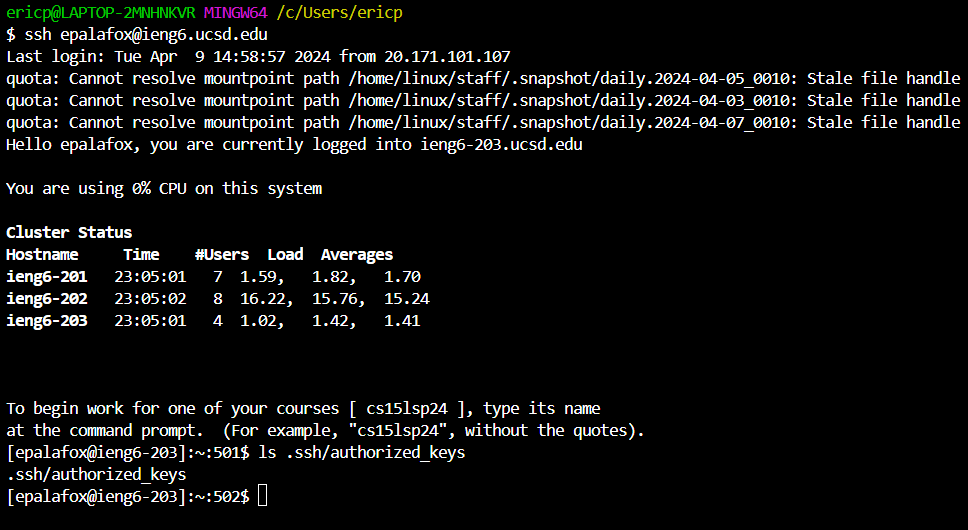
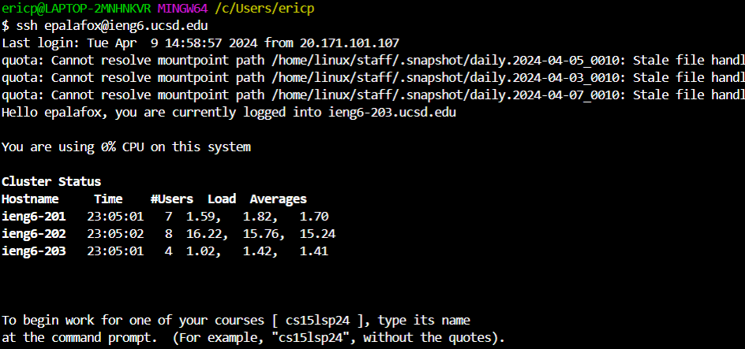

# **Lab Report #2**
***

## Part 1
***
```
import java.io.IOException;
import java.net.URI;

class ChatHandler implements URLHandler {
    // The one bit of state on the server: a number that will be manipulated by
    // various requests.

    String s = "";

    public String handleRequest(URI url) {
        
        if (url.getPath().equals("/")){
            return "Please input a query";
        }
        else {
            if (url.getPath().contains("/add-message")) {
                String[] queries = url.getQuery().split("=");
                
                if(queries[0].equals("s")) {
                    s += queries[2] + ": " +  queries[1].replace("&user", "") + "\n";
                }
                return String.format("%s", s);
            }   
        }
        return "404 Not Found!"; 
    }
}

class ChatServer {
    public static void main(String[] args) throws IOException {
        if(args.length == 0){
            System.out.println("Missing port number! Try any number between 1024 to 49151");
            return;
        }

        int port = Integer.parseInt(args[0]);

        Server.start(port, new ChatHandler());
    }
}
```



- The methods called are going to be the `main()` method which will also calls the methods `parseInt()` and `start()`. The methods called within the class `ChatHandler` are `handleRequest()`, `getPath()`, `contains()`,  `equals()`, `split()`, `getQuery()`, `replace()`, and `format()`.

- The relevant arguments for `main()`, `parseInt()` and `start()` are `String[] args`, `args[0]`, and `port, new ChatHandler()`, respectively. The relevant arguments for `handleRequest()`, `getPath()`, `contains()`,  `equals()`, `split()`, `getQuery()`, `replace()`, and `format()` are `URI url`, no args, `"/add-message"`, `/` and `"s"`, `"="`, no args, `"&user", ""`, and `"%s", s`, respectively. The value of `args[0]` is the port number which in my case was `4000`, the value of `String args[]` is `java ChatServer 4000`, the value of `port` is `4000`, the value of `s` is `""`, the values of `queries` start as empty values, the value of `URI url` is `localhost:4000/`, and the value of `String[] queries` is `""`. 
  
- The string `s` is changed to `ericp: im hungry`, `url` is changed to `localhost:4000/add-message?s=imhungry&user=ericp`, `queries[2]` is changed to `ericp`, and `queries[1]` is changed to `im hungry` since the `replace()` method has been used to replace `&user` with an empty string. We know that `port` did not change since we are running on the same server with the same port number which is also equal to `args[0]`. Finally, `ChatHandler()` has been changed to now contain the complete string which is displayed, `ericp: im hungry`.



- The methods called are going to be the `main()` method which will also call the methods `parseInt()` and `start()`. The methods called within the class `ChatHandler` are `handleRequest()`, `getPath()`, `contains()`,  `equals()`, `split()`, `getQuery()`, `replace()`, and `format()`.

- The relevant arguments for `main()`, `parseInt()` and `start()` are `String[] args`, `args[0]`, and `port, new ChatHandler()`, respectively. The relevant arguments for `handleRequest()`, `getPath()`, `contains()`,  `equals()`, `split()`, `getQuery()`, `replace()`, and `format()` are `URI url`, no args, `"/add-message"`, `/` and `"s`, `"="`, no args, `"&user", ""`, and `"%s", s`, respectively. The value of `args[0]` is the port number which in my case was `4000`, the value of `String args[]` is `java ChatServer 4000`, the value of `port` is `4000`, the value of `s` is `ericp: im hungry`, the value of `URI url` is `localhost:4000/add-message/?s=imhungry&user=ericp`, and the value of `String[] queries` is `add-message?s=imhungry&user=ericp` with each index separated by the `=` character.

- The string `s` is changed to `ericp: im hungry \n joe: so am i, lets get some food dude`, `url` is changed to `localhost:4000/add-message?s=so am i lets get some food dude&user=joe`, `queries[2]` is changed to `joe`, and `queries[1]` is changed to `so am i, lets get some food dude` since the `replace()` method has been used to replace `&user` with an empty string. We know that `port` did not change since we are running on the same server with the same port number which is also equal to `args[0]`. Finally, `ChatHandler()` has been changed to now contain the complete string which is displayed, `ericp: im hungry \n joe: so am i, lets get some food dude`.

## Part 2
***






## Part 3
***
These were interesting weeks as I learned how to start up my own server and deal with different queries. Also, I learned how to connect my personal computer to a server which is located in the CSE basement, this was pretty cool to see how these techniques may help save time when working on a project for example. Finally, I learned how to use different methods such as `getQuery()` which allow us to handle the different url's, this is a very cool topic and can be very useful in many ways.
