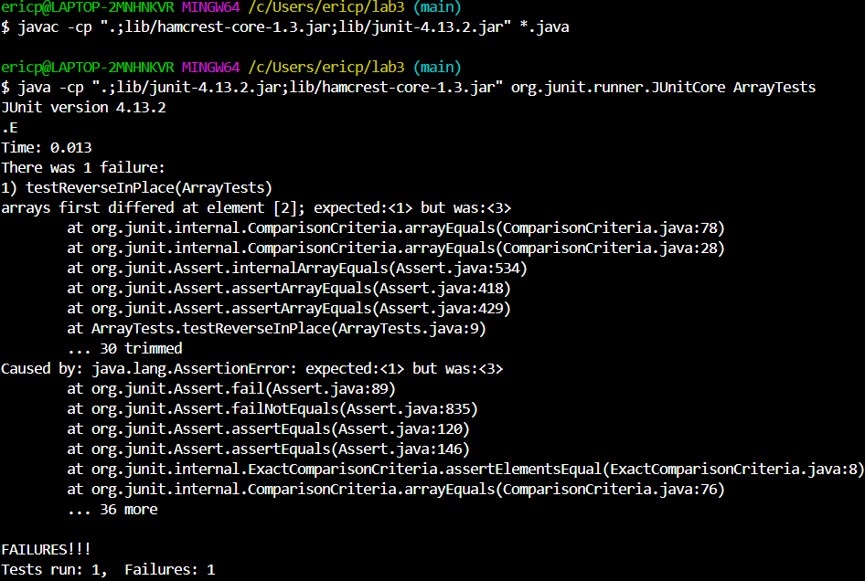
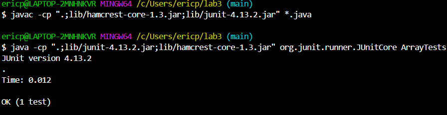

# **Lab Report #3**
***

## Part 1
***

1.

`{1, 2, 3}`

an array of the numbers 1, 2, and 3 is the failure inducing input which demonstrates there is a bug

```
import static org.junit.Assert.*;
import org.junit.*;

public class ArrayTests{
@Test
public void testReverseInPlace(){
  int[] input1 = { 1, 2, 3 };
  ArrayExamples.reverseInPlace(input1);
  assertArrayEquals(new int[] { 3, 2, 1 }, input1);
  }
}
```

2.

`{ 3 }`

an array of the number 3 is the input which does not induce a failure and does not demonstrate there is a bug

```
import static org.junit.Assert.*;
import org.junit.*;

public class ArrayTests {
	@Test 
	public void testReverseInPlace() {
    int[] input1 = { 3 };
    ArrayExamples.reverseInPlace(input1);
    assertArrayEquals(new int[]{ 3 }, input1);
	}
}
```

3.
## Test Failed


## Test Passed


4.
## Before

```
public class ArrayExamples {
  
  // Changes the input array to be in reversed order (contains bug)
  static void reverseInPlace(int[] arr) {
    for(int i = 0; i < arr.length; i += 1) {
      arr[i] = arr[arr.length - i - 1];
    }
  }
}
```

## After

```
public class ArrayExamples {
  
  // Changes the input array to be in reversed order
  static void reverseInPlace(int[] arr) {
    int arrCopy = new int[arr.length];
    for (int i = 0; i < arrCopy.length; i++){
      arrCopy[i] = arr[i];
    }
    for(int i = 0; i < arr.length; i += 1) {
      arr[i] = arrCopy[arr.length - i - 1];
    }
  }
}
```

5. We were able to fix this issue by creating a copy of the array and putting this into `arrCopy`. This will fix the issue since we do not replace the second half of the array as there is
a copy and we do not make any changes to the original array. Before the fix, we were trying to copy the values to the second half of the array, but this was not possible since the values in the
first half of the array were no longer the same as they had been changed in the loop, respectively.

## Part 2
***
