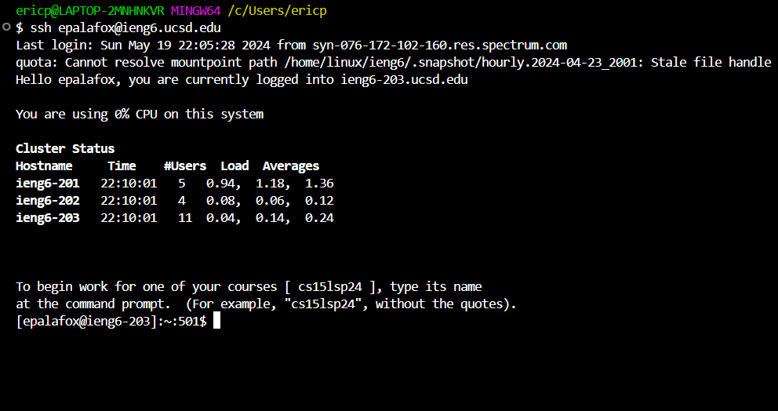
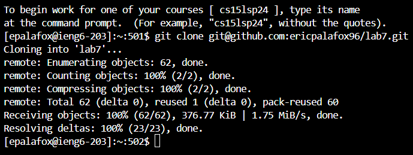
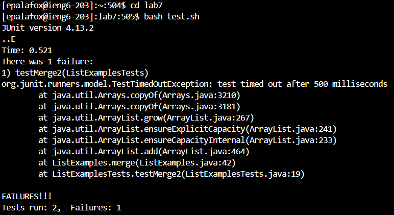
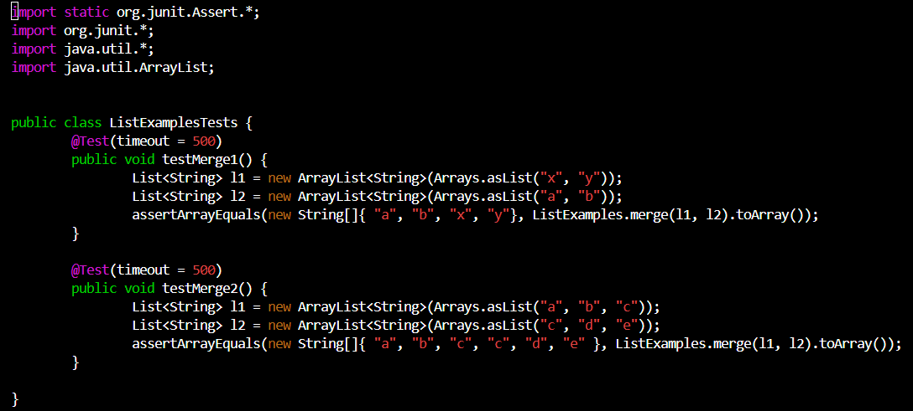
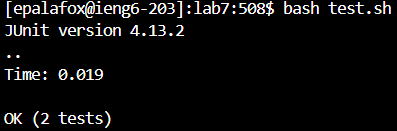
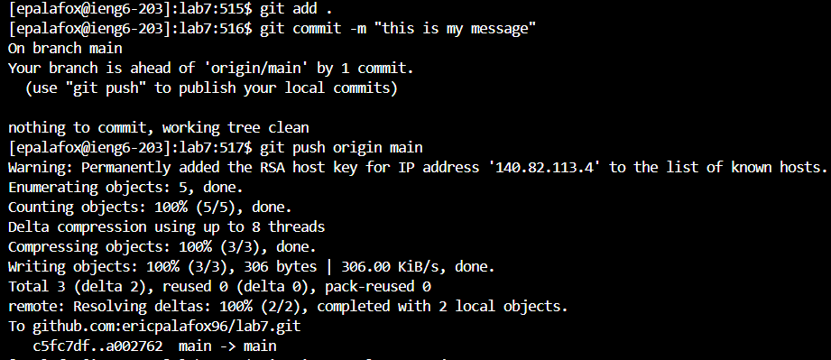

# **Lab Report #4**
***

## Step 4 - Log into ieng6
***
Keys pressed: `ssh` `<space>` `epalafox@ieng6.ucsd.edu`, `<enter>`.
This command allows us to log into the ieng6 server by using the `ssh` command along with my username and the server name appended after the `@`. Since we have previously set this up, we are automatically logged into the server without the need for a password.

## Step 5 - Clone your fork of the repository from your Github account (using the SSH URL)
***
Keys pressed: `git` `<space>` `clone` `<space>` `git@github.com:ericpalafox96/lab7.git`, `<enter>`.
This command `git clone` allows us to clone the repository that we provide as an argument, and will download the contents to the current working directory.

## Step 6 - Run the tests, demonstrating that they fail
***
Keys pressed: `cd` `<space>` `lab7`, `<enter>`, `bash` `<space>` `test.sh`, `<enter>`.
First, we change directories using the `cd` command to go into the `lab7` directory, this way we can run the tests by using `bash test.sh` since this file `test.sh` contains the commands to run the tests, and is located within `lab7`.

## Step 7 - Edit the code file to fix the failing test
***
Keys pressed: `vim` `<space>` `ListExamplesTests.java`, `<enter>`, `/l1` `<enter>`, `n`, `n`, `n`, `<right>`, `x`, `i`, `2`, `<esc>`, `<right>`, `<right>`, `<right>`, `<right>`, `x`, `i`, `1`, `<esc>`, `:wq!`.
The command `vim` allows us to go into a file editor mode within `vim` so that we are able to make changes within the file. We use the `/l1` command to find the occurences of `l1` since we know that is where the bug is located. We can then use `n` to go the next occurence until we have reached the last `l1` which needs to be fixed. Then, we use the `x` command to delete the characters, and `i` to go into insert mode and type the correct characters so the test will succeed. Finally, we use `esc` to exit from the insert mode and finally, we use `wq!` which will save changes and exit the file editor mode.

## Step 8 - Run the tests, demonstrating that they now succeed
***
Keys pressed: `<up>`, `<up>`, `<enter>`.
I used the `up` command twice to go to the previous command `bash test.sh` which will run the tests after the bug has been fixed, and we can see that the tests are now passing as they should.

## Step 9 - Commit and push the resulting change to your Github account (you can pick any commit message!)
***
Keys pressed: `git` `<space>` `add` `<space>` `.`, `<enter>`, `git` `<space>` `commit` `<space>` `-m` `<space>` `"fixed` `<space>` `bugs"`, `<enter>`, `git` `<space>` `push` `<space>` `origin` `<space>` `main`, `<enter>`.
We use the `git add .` command to update all files to ensure that when we commit, the changes will appear in the repository. Next we use the `git commit -m` command to commit the changes to github, and finally we use `git push origin main` which will actually show/push the changes to the remote repository and update the files found on github directly.

